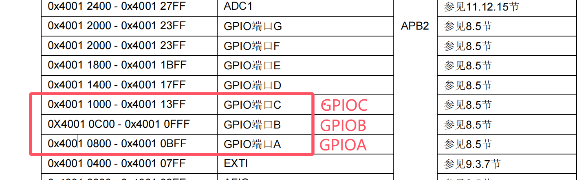
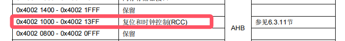
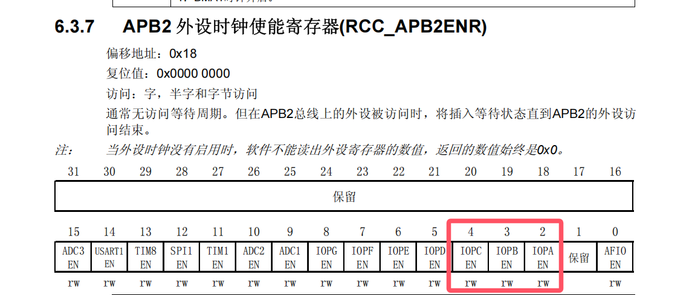
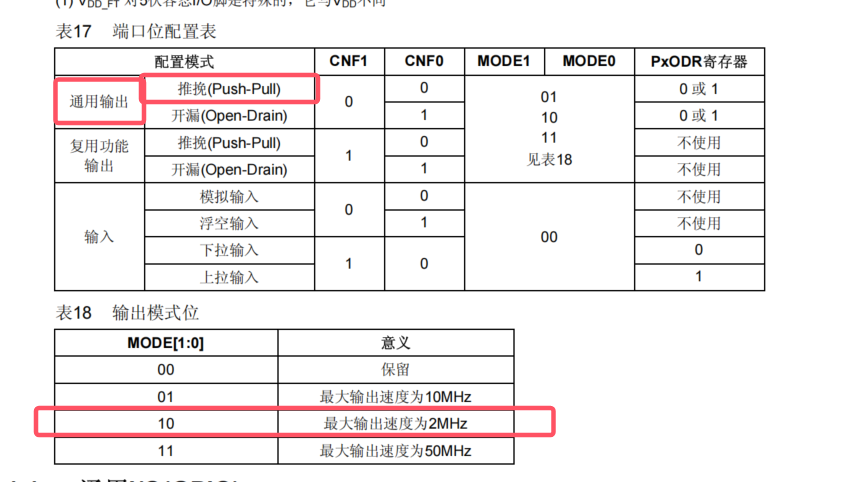
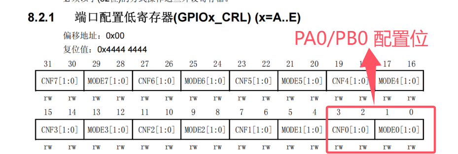
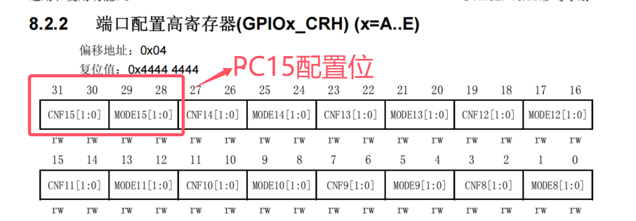
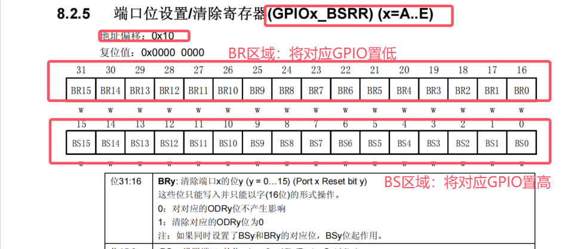
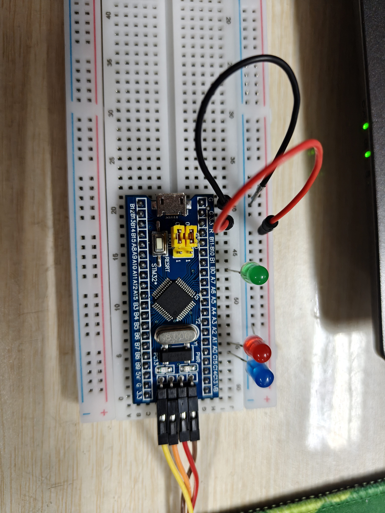
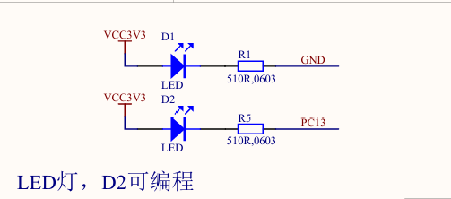
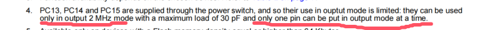

# 从寄存器到流水灯：STM32F103C8T6 GPIO控制与PC13改进实验

## 前言：什么是寄存器

寄存器可以理解为微控制器内部具有特定功能的小型存储单元。STM32中的时钟、GPIO、定时器和串口等外设，都由一组寄存器控制。程序向寄存器的不同位写入0或1，就可以开启外设时钟、设置引脚工作模式或改变引脚输出电平。

STM32采用存储器映射外设方式，为每个外设寄存器分配固定地址。CPU访问这些地址，就相当于操作相应的硬件。例如，本实验通过RCC寄存器开启GPIO时钟，通过GPIO配置寄存器设置输出模式，再通过BSRR寄存器控制LED亮灭。

寄存器的绝对地址通常由外设基地址与寄存器偏移地址相加得到：

```text
寄存器地址 = 外设基地址 + 寄存器偏移地址
```

使用C语言直接访问硬件寄存器时，需要将地址转换为带有`volatile`关键字的指针。`volatile`表示该地址中的值可能随硬件状态发生变化，要求编译器每次都实际访问寄存器，不能省略或合并这些读写操作。寄存器编程能够帮助理解STM32底层硬件的工作过程，也是本实验采用的编程方式。

## 一、实验目的

1. 了解STM32F103C8T6最小系统板的基本结构。
2. 掌握GPIO端口相关寄存器的配置方法。
3. 使用GPIOA、GPIOB和GPIOC控制三个LED以1秒为间隔轮流闪烁。
4. 掌握使用ST-Link下载和调试程序的方法。
5. 将PC13板载LED加入流水灯程序。

## 二、实验环境与器材

- STM32F103C8T6最小系统板
- 面包板
- 红、绿、蓝LED各一个
- 杜邦线
- ST-Link下载器
- Keil MDK开发环境

## 三、实验设计与GPIO寄存器分析

### 3.1 外设基地址

STM32将外设寄存器映射到存储器地址空间，因此可以使用C语言指针直接访问寄存器。本实验所用外设的基地址如下。



*图1 GPIOA、GPIOB和GPIOC外设基地址*



*图2 RCC外设基地址*

后续使用的具体寄存器地址，可由外设基地址与该寄存器的偏移地址相加得到：

```text
寄存器地址 = 外设基地址 + 寄存器偏移地址
```

### 3.2 GPIO端口时钟使能

GPIOA、GPIOB和GPIOC均挂载在APB2总线上，使用这些端口前必须先开启对应的外设时钟。根据《STM32参考手册》，APB2外设时钟使能寄存器`RCC_APB2ENR`的偏移地址为`0x18`，因此其绝对地址为：

```text
RCC_APB2ENR地址
= RCC基地址 + 偏移地址
= 0x40021000 + 0x18
= 0x40021018
```



*图3 RCC_APB2ENR寄存器及GPIO时钟使能位*

与本实验有关的控制位如下：

| 位 | 名称 | 写入1后的作用 |
| --- | --- | --- |
| 位2 | IOPAEN | 开启GPIOA时钟 |
| 位3 | IOPBEN | 开启GPIOB时钟 |
| 位4 | IOPCEN | 开启GPIOC时钟 |

同时开启三个GPIO端口时，需要将位2、位3和位4置1，对应的位掩码为：

```text
(1 << 2) | (1 << 3) | (1 << 4)
= 0x04 | 0x08 | 0x10
= 0x1C
```

程序中需要向该寄存器的位2、位3和位4写入1，具体C语言实现将在“程序设计与实现”部分给出。

### 3.3 LED引脚分配与输出模式

第一版流水灯使用三个不同的GPIO端口，具体分配如下：

| LED | GPIO引脚 | 点亮电平 |
| --- | --- | --- |
| 红色LED | PA0 | 高电平 |
| 绿色LED | PB0 | 高电平 |
| 蓝色LED | PC15 | 高电平 |

三个引脚均配置为通用推挽输出。本实验统一选择2 MHz输出模式。



*图4 GPIO通用推挽输出与2 MHz输出模式*

在输出模式下，`CNF[1:0]=00`表示通用推挽输出，`MODE[1:0]=10`表示最大输出速度为2 MHz。因此，每个GPIO引脚对应的4位配置值为：

```text
CNF1 CNF0 MODE1 MODE0 = 0 0 1 0 = 0x2
```

### 3.4 GPIO配置寄存器

每个GPIO引脚占用配置寄存器中的4位，其中低2位为`MODE`，高2位为`CNF`。引脚0～7由`GPIOx_CRL`配置，引脚8～15由`GPIOx_CRH`配置。

#### 3.4.1 PA0与PB0配置

`GPIOx_CRL`的偏移地址为`0x00`，PA0和PB0均使用该寄存器的位3～位0。



*图5 GPIOx_CRL中PA0和PB0的配置位*

对应寄存器地址为：

```text
GPIOA_CRL = 0x40010800 + 0x00 = 0x40010800
GPIOB_CRL = 0x40010C00 + 0x00 = 0x40010C00
```

配置时需要先将寄存器最低4位清零，再向这4位写入配置值`0x2`。具体C语言实现将在“程序设计与实现”部分给出。

#### 3.4.2 PC15配置

`GPIOx_CRH`的偏移地址为`0x04`，PC15使用`GPIOC_CRH`的位31～位28。



*图6 GPIOx_CRH中PC15的配置位*

`GPIOC_CRH`的地址为：

```text
GPIOC_CRH = 0x40011000 + 0x04 = 0x40011004
```

PC15占用位31～位28，因此将`0xF`左移28位可得到该字段的清零掩码，将配置值`0x2`左移28位可得到需要写入该字段的值。

以上操作只修改目标引脚对应的4位，不会改变同一端口其他引脚的配置。

### 3.5 GPIO置位/复位寄存器

本实验使用`GPIOx_BSRR`控制LED亮灭。向低16位中的某一位写1，会将对应GPIO置为高电平；向高16位中的某一位写1，会将对应GPIO置为低电平。



*图7 GPIOx_BSRR置位与复位字段*

三个端口的`BSRR`寄存器地址为：

```text
GPIOA_BSRR = 0x40010800 + 0x10 = 0x40010810
GPIOB_BSRR = 0x40010C00 + 0x10 = 0x40010C10
GPIOC_BSRR = 0x40011000 + 0x10 = 0x40011010
```

### 3.6 外部LED接线

三个GPIO输出高电平时，对应的外接LED点亮；输出低电平时，LED熄灭。注意3个LED和开发板需要共地。



*图8 三只外接LED与STM32核心板的实际接线*


## 四、程序设计与实现

### 4.1 第一版程序设计思路
程序执行过程如下：

1. 通过`RCC_APB2ENR`开启GPIOA、GPIOB和GPIOC的时钟。
2. 将PA0、PB0和PC15配置为2 MHz通用推挽输出。
3. 通过三个端口的`BSRR`寄存器将所有外接LED初始化为熄灭状态。
4. 使用嵌套空循环函数产生约1秒的软件延时。
5. 依次点亮蓝灯、红灯和绿灯，每次点亮后延时1秒，再熄灭当前LED并切换到下一只LED。
6. 使用无限循环重复上述过程，形成流水灯效果。

### 4.2 第一版程序代码
```c
#include "stm32f10x.h"

/* 将指定地址转换为可读写的32位硬件寄存器。
 * volatile用于防止编译器省略或合并对硬件寄存器的访问。
 */
#define REG32(address)              (*(volatile unsigned int *)(address))

/* RCC与GPIO寄存器的绝对地址，均由“外设基地址+寄存器偏移地址”得到。 */
#define RCC_APB2ENR_REG             REG32(0x40021018u) /* APB2时钟使能。 */
#define GPIOA_CRL_REG               REG32(0x40010800u) /* 配置PA0～PA7。 */
#define GPIOB_CRL_REG               REG32(0x40010C00u) /* 配置PB0～PB7。 */
#define GPIOC_CRH_REG               REG32(0x40011004u) /* 配置PC8～PC15。 */
#define GPIOA_BSRR_REG              REG32(0x40010810u) /* 控制GPIOA输出。 */
#define GPIOB_BSRR_REG              REG32(0x40010C10u) /* 控制GPIOB输出。 */
#define GPIOC_BSRR_REG              REG32(0x40011010u) /* 控制GPIOC输出。 */

/* 软件空循环延时函数。
 * t表示需要延时的毫秒数；外层循环每执行一次，约延时1 ms。
 * volatile和__NOP()可防止编译器把无实际结果的空循环优化掉。
 * 该延时会受系统时钟和编译优化等级影响，8000是按当前72 MHz工程使用的近似值。
 */
static void Delay_ms(volatile unsigned int t)
{
    volatile unsigned int i;

    while (t--)
    {
        for (i = 0u; i < 8000u; i++)
        {
            __NOP(); /* 空操作指令，只消耗CPU时间，不改变寄存器状态。 */
        }
    }
}

int main(void)
{
    /* 位2～位4分别控制GPIOA～GPIOC；“|=”可保留寄存器其他位。 */
    RCC_APB2ENR_REG |= (1u << 2) | (1u << 3) | (1u << 4);

    /* PA0对应CRL位3:0。先清除原配置，再写入0010：CNF=00、MODE=10。 */
    GPIOA_CRL_REG &= ~(0x0Fu << 0);
    GPIOA_CRL_REG |=  (0x02u << 0);

    /* PB0同样对应GPIOB_CRL位3:0，配置为2 MHz通用推挽输出。 */
    GPIOB_CRL_REG &= ~(0x0Fu << 0);
    GPIOB_CRL_REG |=  (0x02u << 0);

    /* PC15对应GPIOC_CRH位31:28，因此掩码和配置值均左移28位。 */
    GPIOC_CRH_REG &= ~(0x0Fu << 28);
    GPIOC_CRH_REG |=  (0x02u << 28);

    /* BSRR高16位BR写1可输出低电平，初始化时先熄灭全部LED。 */
    GPIOA_BSRR_REG = (1u << 16); /* BR0=1，PA0输出低电平。 */
    GPIOB_BSRR_REG = (1u << 16); /* BR0=1，PB0输出低电平。 */
    GPIOC_BSRR_REG = (1u << 31); /* BR15=1，PC15输出低电平。 */

    while (1)
    {
        GPIOC_BSRR_REG = (1u << 15); /* BS15=1，蓝灯亮。 */
        Delay_ms(1000u);             /* 软件延时约1000 ms。 */
        GPIOC_BSRR_REG = (1u << 31); /* BR15=1，蓝灯灭。 */

        GPIOA_BSRR_REG = (1u << 0);  /* BS0=1，红灯亮。 */
        Delay_ms(1000u);             /* 软件延时约1000 ms。 */
        GPIOA_BSRR_REG = (1u << 16); /* BR0=1，红灯灭。 */

        GPIOB_BSRR_REG = (1u << 0);  /* BS0=1，绿灯亮。 */
        Delay_ms(1000u);             /* 软件延时约1000 ms。 */
        GPIOB_BSRR_REG = (1u << 16); /* BR0=1，绿灯灭。 */
    }
}
```

## 五、程序下载与实验现象

实验中，三只外接LED按照“蓝灯→红灯→绿灯”的顺序循环点亮，每只LED保持点亮约1秒，实际现象与程序设计一致。

<video controls width="720">
  <source src="images/09_external_led_flow.mp4" type="video/mp4">
  当前Markdown阅读器不支持直接播放视频。
</video>

[点击查看三只外接LED流水灯实验视频](images/09_external_led_flow.mp4)

## 六、PC13板载LED改进实验

### 6.1 PC13板载LED原理

根据[STM32 Blue Pill开发板原理图](https://stm32-base.org/assets/pdf/boards/original-schematic-STM32F103C8T6-Blue_Pill.pdf)



*图9 PC13板载LED连接原理图*

板载LED的正极通过限流电阻连接3.3V，负极连接PC13，因此PC13输出低电平时LED点亮，输出高电平时LED熄灭。

### 6.2 PC13与PC15的输出限制

根据STM32F103C8T6数据手册，PC13、PC14和PC15作为输出引脚时只能使用2 MHz输出模式，而且同一时刻只能将其中一个引脚配置为输出。



*图10 PC13、PC14和PC15作为输出引脚时的限制*

本实验的外接蓝灯使用PC15，板载LED使用PC13，因此第二版程序需要动态切换二者的工作模式：控制外接蓝灯时，只将PC15配置为输出；控制板载LED时，先将PC15恢复为浮空输入，再将PC13配置为输出。

浮空输入的配置值为`CNF=01、MODE=00`，即`0x4`；2 MHz通用推挽输出的配置值为`CNF=00、MODE=10`，即`0x2`。这样可以保证PC13和PC15不会同时处于输出模式。

### 6.3 第二版程序设计思路

第二版在三只外接LED的基础上加入PC13板载LED，按照“蓝灯→红灯→绿灯→板载LED”的顺序循环点亮，每次间隔1秒。三个外接LED为高电平点亮，PC13板载LED为低电平点亮。

### 6.4 第二版程序代码

以下代码为加入PC13板载LED后的完整程序，已经完成编译、下载和实物运行验证。

```c
#include "stm32f10x.h"

/* 将指定地址转换为可读写的32位硬件寄存器。
 * volatile用于防止编译器省略或合并对硬件寄存器的访问。
 */
#define REG32(address)              (*(volatile unsigned int *)(address))

/* RCC与GPIO寄存器的绝对地址，均由“外设基地址+寄存器偏移地址”得到。 */
#define RCC_APB2ENR_REG             REG32(0x40021018u) /* 0x40021000+0x18，APB2时钟使能。 */
#define GPIOA_CRL_REG               REG32(0x40010800u) /* 0x40010800+0x00，配置PA0～PA7。 */
#define GPIOB_CRL_REG               REG32(0x40010C00u) /* 0x40010C00+0x00，配置PB0～PB7。 */
#define GPIOC_CRH_REG               REG32(0x40011004u) /* 0x40011000+0x04，配置PC8～PC15。 */
#define GPIOA_BSRR_REG              REG32(0x40010810u) /* 0x40010800+0x10，控制GPIOA输出。 */
#define GPIOB_BSRR_REG              REG32(0x40010C10u) /* 0x40010C00+0x10，控制GPIOB输出。 */
#define GPIOC_BSRR_REG              REG32(0x40011010u) /* 0x40011000+0x10，控制GPIOC输出。 */

/* GPIOC_CRH中PC13和PC15配置字段的起始位。 */
#define PC13_CONFIG_SHIFT           20u
#define PC15_CONFIG_SHIFT           28u

/* STM32F1每个GPIO引脚使用4位配置。
 * 0x2：CNF=00、MODE=10，表示2 MHz通用推挽输出。
 * 0x4：CNF=01、MODE=00，表示浮空输入。
 */
#define GPIO_OUTPUT_2MHZ_PP         0x02u
#define GPIO_FLOATING_INPUT         0x04u

/* 软件空循环延时函数。
 * t表示需要延时的毫秒数；外层循环每执行一次，约延时1 ms。
 * volatile和__NOP()可防止编译器把无实际结果的空循环优化掉。
 * 该延时会受系统时钟和编译优化等级影响，8000是按当前72 MHz工程使用的近似值。
 */
static void Delay_ms(volatile unsigned int t)
{
    volatile unsigned int i;

    while (t--)
    {
        for (i = 0u; i < 8000u; i++)
        {
            __NOP(); /* 空操作指令，只消耗CPU时间，不改变寄存器状态。 */
        }
    }
}

/* 修改GPIOC_CRH中的一个4位配置字段。
 * shift表示目标字段最低位的位置，config表示要写入的4位配置值。
 * 先清除目标字段，再写入新值，不会改变GPIOC其他引脚的配置。
 */
static void gpio_c_set_config(unsigned int shift, unsigned int config)
{
    GPIOC_CRH_REG &= ~(0x0Fu << shift);
    GPIOC_CRH_REG |=  (config << shift);
}

int main(void)
{
    /* RCC_APB2ENR的位2、位3和位4分别为IOPAEN、IOPBEN和IOPCEN。
     * 使用“|=”只把这三位置1，并保留寄存器中其他位的原值。
     */
    RCC_APB2ENR_REG |= (1u << 2) | (1u << 3) | (1u << 4);

    /* 每个GPIO引脚占4个配置位，高2位为CNF，低2位为MODE。
     * PA0对应GPIOA_CRL位3:0。先用0xF的反码清除原配置，
     * 再写入二进制0010，即CNF=00、MODE=10，配置为2 MHz通用推挽输出。
     */
    GPIOA_CRL_REG &= ~(0x0Fu << 0);
    GPIOA_CRL_REG |=  (0x02u << 0);

    /* PB0同样对应GPIOB_CRL位3:0，配置值也为0x2。 */
    GPIOB_CRL_REG &= ~(0x0Fu << 0);
    GPIOB_CRL_REG |=  (0x02u << 0);

    /* 数据手册规定PC13～PC15同一时刻只能有一个引脚作为输出。
     * 初始化时先将PC13和PC15都设置为浮空输入，随后按流水灯阶段动态切换。
     */
    gpio_c_set_config(PC13_CONFIG_SHIFT, GPIO_FLOATING_INPUT);
    gpio_c_set_config(PC15_CONFIG_SHIFT, GPIO_FLOATING_INPUT);

    /* 外接LED均为高电平点亮，因此PA0、PB0和PC15预置低电平。
     * 板载LED为低电平点亮，因此PC13预置高电平使其保持熄灭。
     * 即使引脚当前是输入模式，写BSRR仍可预先设置对应ODR锁存位。
     */
    GPIOA_BSRR_REG = (1u << 16); /* BR0=1，使PA0输出低电平。 */
    GPIOB_BSRR_REG = (1u << 16); /* BR0=1，使PB0输出低电平。 */
    GPIOC_BSRR_REG = (1u << 31); /* BR15=1，使PC15输出低电平。 */
    GPIOC_BSRR_REG = (1u << 13); /* BS13=1，使PC13预置高电平。 */

    while (1)
    {
        /* 阶段1：点亮PC15控制的外接蓝灯。
         * 此时PC13保持浮空输入，只将PC15切换为2 MHz推挽输出。
         */
        gpio_c_set_config(PC13_CONFIG_SHIFT, GPIO_FLOATING_INPUT);
        gpio_c_set_config(PC15_CONFIG_SHIFT, GPIO_OUTPUT_2MHZ_PP);
        GPIOC_BSRR_REG = (1u << 15);             /* BS15=1，蓝灯亮。 */
        Delay_ms(1000u);                         /* 软件延时约1000 ms。 */
        GPIOC_BSRR_REG = (1u << 31);             /* BR15=1，蓝灯灭。 */
        gpio_c_set_config(PC15_CONFIG_SHIFT, GPIO_FLOATING_INPUT);

        /* 阶段2：点亮PA0控制的外接红灯。 */
        GPIOA_BSRR_REG = (1u << 0);              /* BS0=1，红灯亮。 */
        Delay_ms(1000u);                         /* 软件延时约1000 ms。 */
        GPIOA_BSRR_REG = (1u << 16);             /* BR0=1，红灯灭。 */

        /* 阶段3：点亮PB0控制的外接绿灯。 */
        GPIOB_BSRR_REG = (1u << 0);              /* BS0=1，绿灯亮。 */
        Delay_ms(1000u);                         /* 软件延时约1000 ms。 */
        GPIOB_BSRR_REG = (1u << 16);             /* BR0=1，绿灯灭。 */

        /* 阶段4：点亮PC13控制的板载LED。
         * 先确保PC15为浮空输入，再将PC13切换为2 MHz推挽输出。
         * 板载LED低电平有效，因此向BR13写1时点亮，向BS13写1时熄灭。
         */
        gpio_c_set_config(PC15_CONFIG_SHIFT, GPIO_FLOATING_INPUT);
        gpio_c_set_config(PC13_CONFIG_SHIFT, GPIO_OUTPUT_2MHZ_PP);
        GPIOC_BSRR_REG = (1u << 29);             /* BR13=1，板载LED亮。 */
        Delay_ms(1000u);                         /* 软件延时约1000 ms。 */
        GPIOC_BSRR_REG = (1u << 13);             /* BS13=1，板载LED灭。 */
        gpio_c_set_config(PC13_CONFIG_SHIFT, GPIO_FLOATING_INPUT);
    }
}
```

### 6.5 第二版实验现象

PC13板载LED能够正常参与流水过程，实际现象与设计一致。

<video controls width="720">
  <source src="images/12_pc13_led_flow.mp4" type="video/mp4">
  当前Markdown阅读器不支持直接播放视频。
</video>

[点击查看加入PC13板载LED后的流水灯视频](images/12_pc13_led_flow.mp4)

## 七、实验总结

这次实验让我对“寄存器控制硬件”有了更直观的认识。以前看到寄存器地址、位偏移和掩码时感觉比较抽象，这次通过查阅数据手册，亲自计算RCC和GPIO寄存器地址，再把相应位写入程序，我逐渐理解了每条寄存器语句与LED实际状态之间的对应关系，也掌握了GPIO模式配置、BSRR置位与复位以及软件空循环延时的基本方法。

调试过程中，我发现外接LED是高电平点亮，而PC13板载LED是低电平点亮，并且PC13与PC15还存在不能同时配置为输出的限制。通过查阅原理图和数据手册，最终使用动态切换输入、输出模式的方法解决了这个问题。当三只外接LED和板载LED按照设定顺序正常循环点亮时，我很有成就感。这次实验也让我认识到，遇到硬件现象与预期不一致时，认真查看芯片手册和电路原理图往往比反复修改代码更有效。

## 参考资料

1. STMicroelectronics，`STM32F103x8/STM32F103xB Datasheet`（本实验目录中的`c8t6 datasheet.pdf`）。
2. STMicroelectronics，`STM32F10xxx参考手册 RM0008 中文版`（本实验目录中的`STM32中文参考手册_V10.pdf.pdf`）。
3. [STM32F103C8T6 Blue Pill开发板原理图](https://stm32-base.org/assets/pdf/boards/original-schematic-STM32F103C8T6-Blue_Pill.pdf)。
4. [STM32寄存器实现流水灯](https://blog.csdn.net/qq_47281915/article/details/120812867)。
5. [STM32F103流水灯点亮（寄存器地址操作）](https://blog.csdn.net/m0_63323712/article/details/133362282)。
6. [STM32学习参考资料一](https://blog.csdn.net/geek_monkey/article/details/86291377)。
7. [STM32学习参考资料二](https://blog.csdn.net/geek_monkey/article/details/86293880)。
